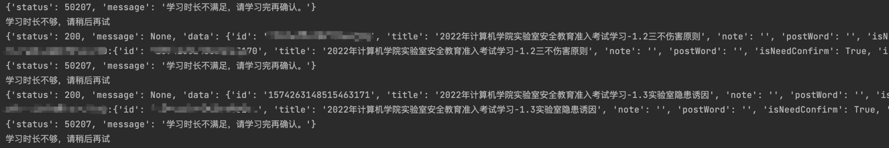
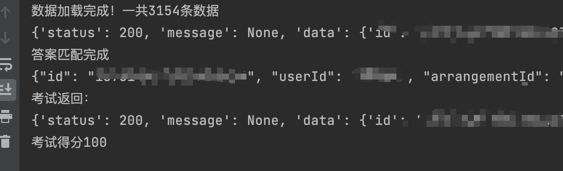

# 实验室安全自动学习脚本
---

## 功能介绍

1. 广工实验室安全视频提交
2. 考试自动100分

环境

* python3
* requests: 使用`pip install requests`安装
* tqdm: 使用`pip install tqdm`安装，用来显示进度条

整体流程

* 1.[登录系统](https://labsafety.gdut.edu.cn/)，拿到token，复制到AutoCheck.py中headers的`Authorization`
* 2.`python AutoCheck.py`运行,自动提交观看视频情况，等待10分钟再次提交，因为是后台管理观看时间
* 3.`python exam.py`运行，自动提交考试，考试100分（1s），如果介意请自己进入考试，然后拿到Id好，自己等待时机再提交
* 4.如果某次运行出现timeout等超时异常，可以再次运行，如果多次运行都出现问题，请检查你的网络或提issue。
* 5.exam的更多使用请看exam.py的注释

**拿token截图**

**运行截图**

第一次提交视频请求结果如下,显示学习时长不满足是正常情况，后台自动计时了，过10min反复多提交几次就会自动看完

考试成功结果

**提示**

1. 因为后台限制了"需要"观看一定时间,所以需要隔一段时间（5-10min）在再运行几次。
2. 第一次运行输出每个视频提交完成的情况，视频可能会提示观看时间不符合要求，这个时候等等待一会再重新提交。
3. 视频列表是返回是用根据未观看视频排序，遇到已经完成的视频脚本会自动退出。
4. 对于后台观看时间是否限制，懒得改了，能润就行。可能是根据信息获取开始计算时间？

**交流**

1. 如果有什么问题，欢迎提issue
2. 有什么好的建议，欢迎提pr

