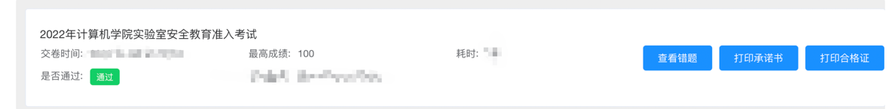

# 实验室安全自动学习脚本
---
## 介绍 
广工实验室安全自动学习脚本，先登录统一认证拿到token，然后直接运行
环境
* python3
* requests: 使用`pip install requests`安装

整体流程
* 1.登录统一认证，拿到token，复制到AutoCheck.py中headers的`Authorization`
* 2.`python AutoCheck.py`运行

**拿token截图** 

 

**运行截图**
 

**提示**

1. 因为后台个别视频限制了"需要"观看一定时间,所以需要隔一段时间（5-10min）在再运行几次。
2. 第一次运行后会输出每个视频提交完成的情况，个别视频可能会提示观看时间不符合要求，这个时候等等待一会再重新提交。
3. 视频列表是返回是用根据未观看视频排序，遇到已经完成的视频脚本会自动退出。
4. 对于后台观看时间限制懒的猜了，能润就行。可能是根据信息获取开始计算时间？有点笨哈

**交流** 
1. 如果有什么问题，欢迎提issue
2. 有什么好的建议，欢迎提pr

